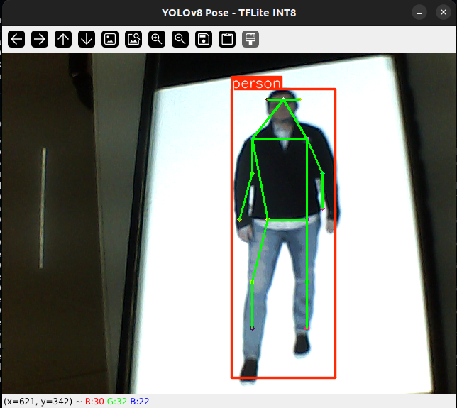

# YOLOv8 Pose Estimation with TFLite INT8 and Webcam Inference

This project demonstrates how to:
- Export a YOLOv8-pose model to TensorFlow Lite (TFLite) format with full integer (INT8) quantization.
- Run real-time pose estimation inference using a webcam and the exported TFLite model.

---

## 📁 Project Structure

```

├── calibration\_image\_sample\_data\_20x128x128x3\_float32.npy  # Optional: used for quantization calibration
├── coco8-pose/                                             # Dataset directory (COCO-style)
│   ├── images/                                             # Training/validation images
│   └── labels/                                             # YOLO-format labels
├── dataset.yaml                                            # Dataset config file
├── int8\_export.py                                          # Script to export model to INT8 TFLite
├── pose.py                                                 # Real-time inference script using webcam
├── yolo11n-pose.pt                                         # Trained YOLOv8-pose PyTorch model
├── yolo11n-pose.onnx                                       # Optional ONNX version
├── yolo11n-pose\_saved\_model/                               # Exported TFLite model files
│   ├── yolo11n-pose\_float16.tflite
│   ├── yolo11n-pose\_float32.tflite
│   ├── yolo11n-pose\_int8.tflite
│   ├── yolo11n-pose\_integer\_quant.tflite
│   └── yolo11n-pose\_full\_integer\_quant.tflite

````

---

## 🧠 Model Export to TFLite INT8

To export the YOLOv8-pose model (`yolo11n-pose.pt`) to a fully quantized INT8 TFLite format:

```bash
python int8_export.py
````

**`int8_export.py`:**

```python
from ultralytics import YOLO

model = YOLO("yolo11n-pose.pt")

model.export(
    format="tflite",
    int8=True,
    imgsz=256,               # Match with your training size
    data="dataset.yaml"      # Dataset config (COCO-style format)
)
```

This generates various `.tflite` files including:

* `yolo11n-pose_int8.tflite`
* `yolo11n-pose_full_integer_quant.tflite`

> ✅ We use `yolo11n-pose_full_integer_quant.tflite` for inference.

---

## 🎥 Real-Time Inference with Webcam

To run pose estimation using your webcam with the TFLite INT8 model:

```bash
python pose.py
```

This will:

* Open your webcam.
* Perform real-time inference.
* Display keypoints and skeleton overlays on the detected human poses.
* Press **`q`** to quit the app.

> ⚠️ Make sure your camera is accessible and permissions are granted.

---

## 📌 Key Features

* **Model**: YOLOv8 Nano Pose (YOLOv8n-pose)
* **Exported Format**: TFLite (INT8, full integer quantized)
* **Inference**: Uses `TensorFlow Lite Interpreter` on CPU
* **Visualization**: Draws bounding boxes and 17-point COCO skeleton keypoints using OpenCV

---

## 📷 Sample Output



---

## 📝 Dependencies

Make sure you have the following Python packages installed:

```bash
pip install opencv-python numpy tensorflow
```

> Ensure you are using TensorFlow ≥ 2.5 for TFLite interpreter support.

---

## 📖 References

* [Ultralytics YOLOv8 Documentation](https://docs.ultralytics.com)
* [TensorFlow Lite Guide](https://www.tensorflow.org/lite/guide)
* [COCO Keypoints Format](https://cocodataset.org/#keypoints-eval)
